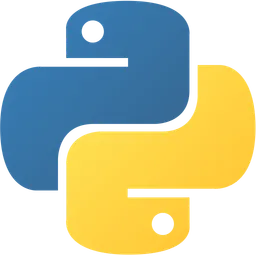

## Olá! Sou Mateus Nobrega 👋  

  

  

# Linguagens 📚

  
  
  
  
  
  

  

# Experiência 🚀

Análise de Sistemas: Atualmente, estou aprofundando meus conhecimentos em análise e desenvolvimento de sistemas na FIAP. Meu foco é entender melhor a arquitetura de software, o design de banco de dados e a gestão de projetos. Meu objetivo é utilizar essas competências para criar sistemas robustos e escaláveis. Estou entusiasmado para aplicar o que estou aprendendo na construção de soluções eficazes

# Interesses 📖
-Tenho interesse na área de tecnologia.
-Desejo viajar para outro país.
-Aspiro desenvolver projetos que causem grandes impactos.
-

# Contatos 📞
 <a href="https://www.linkedin.com/in/mateus-nobrega-41b7702b8?lipi=urn%3Ali%3Apage%3Ad_flagship3_profile_view_base_contact_details%3Bz9i0B54cTYS2GYKcSGSNaA%3D%3D">
  

  <a href="https://www.instagram.com/_mateuziinn/">
  
 
  <a href="mailto:nobre6657@gmail.com">
  

