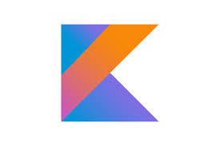

## Olá! Sou Mateus Nobrega 👋

# Linguagens 📚
        
 

  

# Experiência 🚀

Análise de Sistemas: Atualmente, estou aprofundando meus conhecimentos em análise e desenvolvimento de sistemas na FIAP. Meu foco é entender melhor a arquitetura de software, o design de banco de dados e a gestão de projetos. Meu objetivo é utilizar essas competências para criar sistemas robustos e escaláveis. Estou entusiasmado para aplicar o que estou aprendendo na construção de soluções eficazes

# Interesses 📖
-Tenho interesse na área de tecnologia.
-Desejo viajar para outro país.
-Aspiro desenvolver projetos que causem grandes impactos.
-

# Contatos 📞

